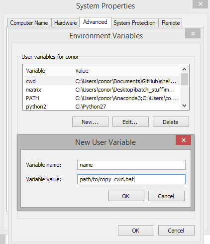
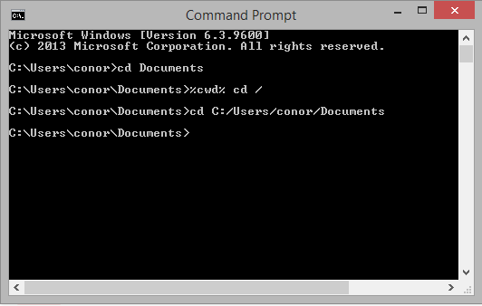

| File         | Function                                   | Requirements |
|--------------|--------------------------------------------|--------------|
| copy_cwd2.py | copy current working directory to cliboard | python2      |
| copy_cwd3.py | copy current working directory to cliboard | python3      |
| copy_cwd.bat | call appropriate python file               | Windows OS   |

## Set up
You can run copy_cwd.bat directly using the full path to the script, but it's much easier to add it as an environment variable. Here's how:

* Use <kbd>windows key</kbd> + <kbd>s</kbd> and search for environment variables.  
* Add the path to copy_cwd.bat and name it whatever you want.  
* You can then call copy_cwd.bat anywhere in shell using `%your_varibale_name%`.  

## Arguements   
* `/` will replace all `\` in the path with `/`  
* `cd` will add `cd ` to the beginning of the current working directory    

for example `%cwd% \ cd` will change `c:\user\documents` to `cd c:/user/documents`

##Why use this at all
If you use `echo pwd |clip` you can copy the current working directory to the clipboard in windows, so what's the point of this anyway?  

If you have cygwin installed, you get `/cygdrive/` before the file path, so I decided to write a python script to copy the working directory from the console to the clipboard, without the prefix.

[This stack exchange post](http://unix.stackexchange.com/questions/44677/how-do-i-get-rid-of-cygwins-cygdrive-prefix-in-all-paths/44680#44680?newreg=5bf3947c5aaa46d5b08916062b6196c6) also explains how to remove the cygwin prefix by modifying `/etc/fstab` but that still leaves a `/` prefix, which means you can't use **"`cd` <kbd>ctrl</kbd>+<kbd>v</kbd>"** because you'll be using a relative path. 

The `/` argument is useful if you need the current working directory with forward instead of backslashes. R for example, doesn't allow you to set the working directory of a script using a path with backslashes.
